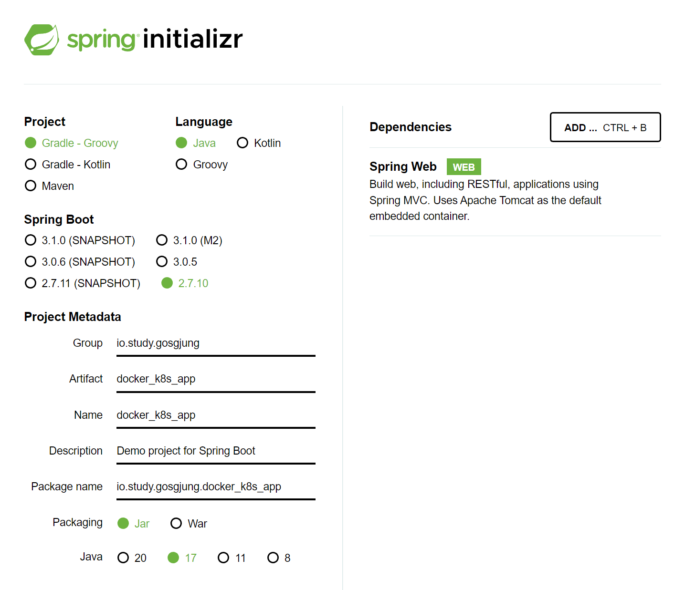
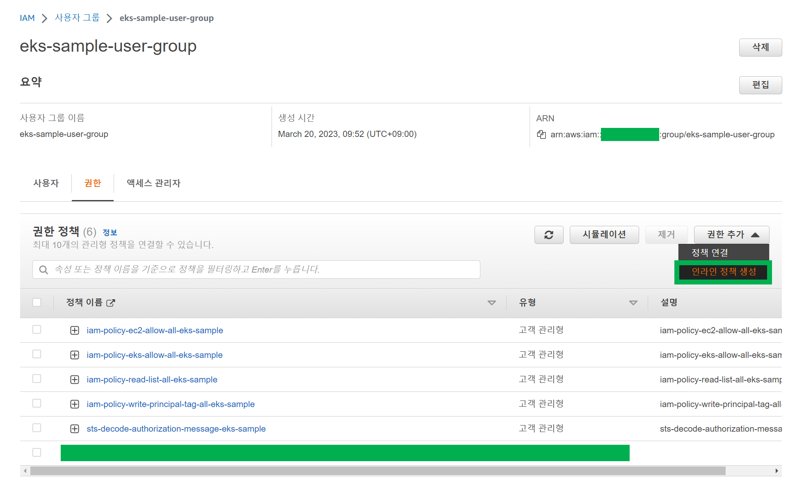
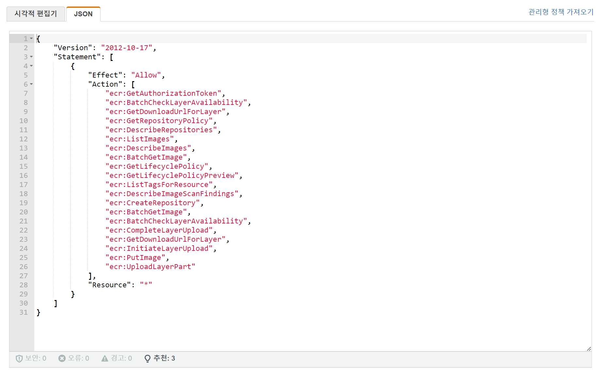
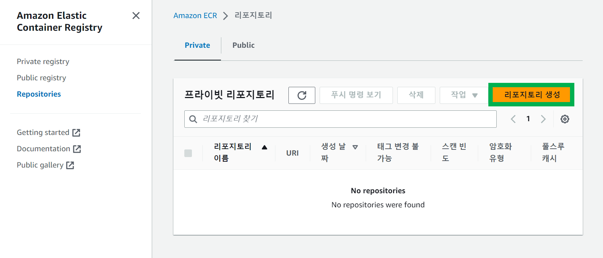
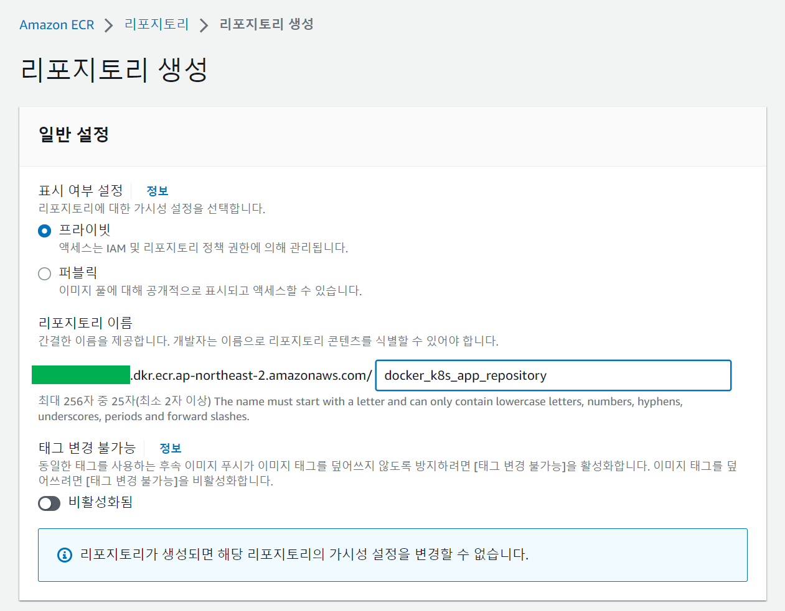
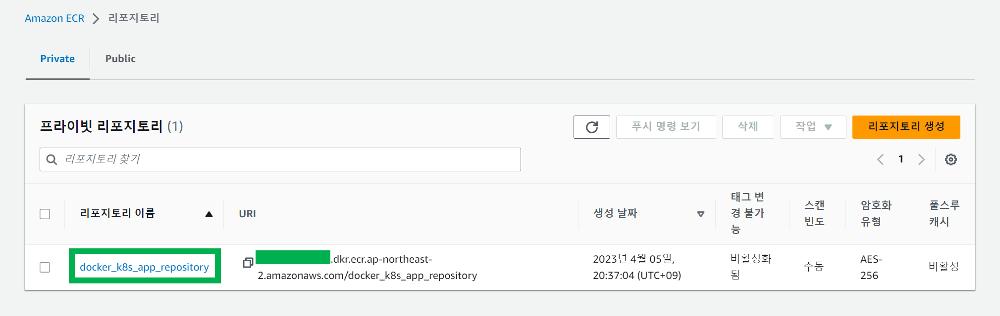
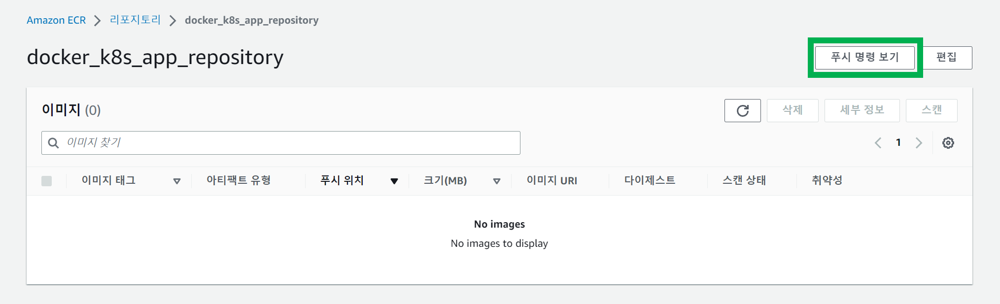
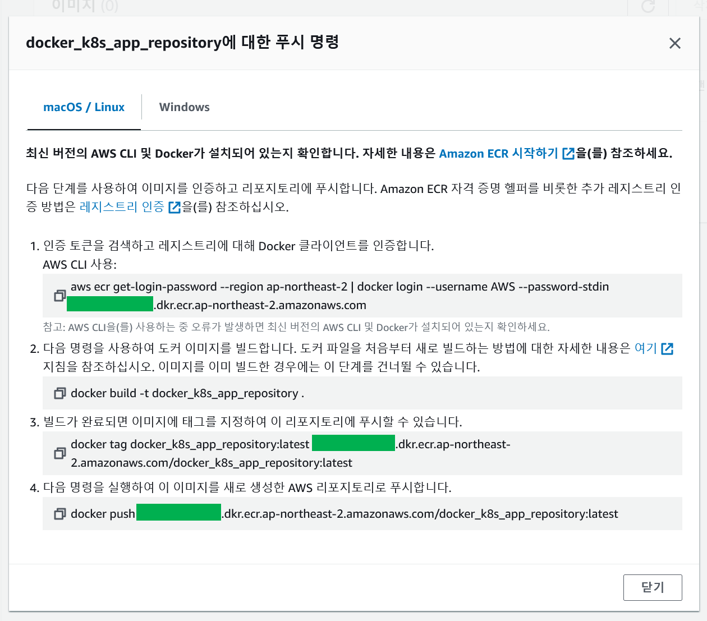

### Spring Boot Application

스프링 부트 애플리케이션은 아래와 같은 구성으로 생성했다.



<br>


그리고 Controller 를 아래와 같이 작성해줬다.

```java
import org.springframework.web.bind.annotation.GetMapping;
import org.springframework.web.bind.annotation.RestController;

@RestController
public class HelloWorldController {

    @GetMapping("/")
    public String index(){
        return "Hello World!";
    }
    
}
```

<br>


### jar 파일 빌드

```bash
$ gradlew bootJar
```

<br>


### Dockerfile 정의 및 이미지 빌드

도커파일은 아래와 같이 작성했다.

plain build 를 할 수도 있고, spring boot 의 특정 버전대부터는 컨테이너를 만들때 layertools를 통해 최적화되는 걸로 알고 있다.

하지만, 일단은 직접 최적화를 하는 것까지 포함한 Docker 이미지 빌드 스크립트를 추가했다.

```dockerfile
FROM openjdk:17-alpine AS jar-image
WORKDIR deploy
COPY build/libs/layering_docker_image279-v1.0.jar app.jar
RUN java -jar -Djarmode=layertools app.jar extract

FROM openjdk:17-alpine
WORKDIR deploy
COPY --from=jar-image deploy/dependencies/ ./
COPY --from=jar-image deploy/snapshot-dependencies/ ./
COPY --from=jar-image deploy/spring-boot-loader/ ./
COPY --from=jar-image deploy/application/ ./

ENTRYPOINT ["java", "org.springframework.boot.loader.JarLauncher"]
```

- `COPY --from=jar-image deploy/dependencies/ ./`
  - jar 파일 내에서 deploy/dependencies 디렉터리 만을 복사해서 현재 WORKDIR 로 복사한다.
- `COPY --from=jar-image deploy/snapshot-dependencies/ ./`
  - jar 파일 내에서 deploy/snapshot-dependencies 디렉터리 만을 복사해서 현재 WORKDIR 로 복사한다.
- `COPY --from=jar-image deploy/spring-boot-loader/ ./`
  - jar 파일 내에서 deploy/spring-boot-loader 디렉터리 만을 복사해서 현재 WORKDIR 로 복사한다.
- `COPY --from=jar-image deploy/application/ ./` 
  - jar 파일 내에서 deploy/application 디렉터리 만을 복사해서 현재 WORKDIR 로 복사한다.

<br>


**이미지 빌드**<br>

```bash
$ docker build -t docker_k8s_app .
```

<br>


**컨테이너 실행**<br>

```bash
$ docker container run --rm -d -p 8080:8080 --name docker_k8s_app docker_k8s_app
```

<br>


**이미지 확인**<br>

```bash
$ docker ps
```

<br>


**컨테이너 종료**

```bash
$ docker container stop docker_k8s_app
```

<br>


### IAM Role 추가

개발자 입장에서 추가한 거라 조금은 필요 없는 권한이 추가되있을 수도 있다. 개발도 빨리해야 하는데, 인프라도 알아야돼 이런건 물리적인 시간을 역행하는 시간여행자식 자본논리인듯 싶다.


> 참고자료 
>
> - [Amazon Elastic Container Registry 자격 증명기반 정책 예제 > Amazon ECR 콘솔 사용](https://docs.aws.amazon.com/ko_kr/AmazonECR/latest/userguide/security_iam_id-based-policy-examples.html)
>   - JSON 정책을 가져와서 사용했다.
>
> - [Pushing an image to ECR, getting "Retrying in ... seconds"](https://stackoverflow.com/questions/70828205/pushing-an-image-to-ecr-getting-retrying-in-seconds)
>   - 중간에 안될때가 있었는데, 어떤 권한 몇개가 없어서 그런거였다. (e.g. BatchGetImage 등등)
> - 제일 처음 봤던 자료
>   - [Amazon Elastic Container Registry 용 Identity and Access Management](https://docs.aws.amazon.com/ko_kr/AmazonECR/latest/userguide/security-iam.html)

특정 IAM 사용자의 IAM Role 이 필요한데, 내 경우는 사용자 그룹에 JSON 권한을 추가해줬다.

```json
{
    "Version": "2012-10-17",
    "Statement": [
        {
            "Effect": "Allow",
            "Action": [
                "ecr:GetAuthorizationToken",
                "ecr:BatchCheckLayerAvailability",
                "ecr:GetDownloadUrlForLayer",
                "ecr:GetRepositoryPolicy",
                "ecr:DescribeRepositories",
                "ecr:ListImages",
                "ecr:DescribeImages",
                "ecr:BatchGetImage",
                "ecr:GetLifecyclePolicy",
                "ecr:GetLifecyclePolicyPreview",
                "ecr:ListTagsForResource",
                "ecr:DescribeImageScanFindings",
                "ecr:CreateRepository",
                "ecr:BatchGetImage",
                "ecr:BatchCheckLayerAvailability",
                "ecr:CompleteLayerUpload",
                "ecr:GetDownloadUrlForLayer",
                "ecr:InitiateLayerUpload",
                "ecr:PutImage",
                "ecr:UploadLayerPart"
            ],
            "Resource": "*"
        }
    ]
}
```


사용자 그룹에 인라인 정책을 연결해준다.



<br>



<br>


### ECR 리포지터리 생성

docker_k8s_app_repository



<br>




<br>




<br>




<br>


윈도우에서는 다른 명령어를 쓰라고 탭이 분리되어 있는데 윈도우 명령어가 안통해서 리눅스 명령어를 그대로 사용하니 되었다.




각각의 명령어는 아래에 정리해뒀다.

```bash
$ aws ecr get-login-password --region ap-northeast-2 | docker login --username AWS --password-stdin 693608546603.dkr.ecr.ap-northeast-2.amazonaws.com


$ docker build -t docker_k8s_app_repository .


$ docker tag docker_k8s_app_repository:latest 693608546603.dkr.ecr.ap-northeast-2.amazonaws.com/docker_k8s_app_repository:latest


$ docker push 693608546603.dkr.ecr.ap-northeast-2.amazonaws.com/docker_k8s_app_repository:latest
```


### eksctl 로 클러스터 생성

클러스터는 웹 콘솔이나 테라폼으로 세부권한을 추가해서 해줄수도 있는데, 일단은 빠른 예제를 위해 아래와 같이 해줬다.


